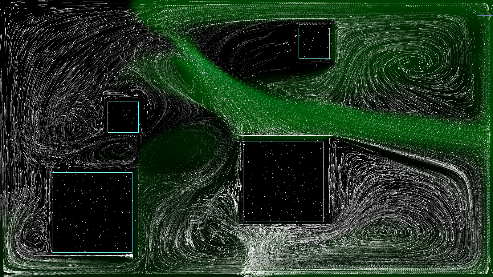

FluidSolver
===========

Real time 2D simulator of fluid mechanics in C++/Qt/OpenGl.

Watch a demo on youtube: [https://www.youtube.com/watch?v=i2-zOoBbdk0](https://www.youtube.com/watch?v=i2-zOoBbdk0)

Description
------------

 This project provides open-source librairies to solve the Navier-Stokes equations based on Jos Stam paper,
 and an interface to simulate a fluid in 2D. 

 The source code can be found in the following directories:
  * __solver__ : solving librairies;
  * __display__: interface.

Instructions
------------

      $PATH_TO_BIN/FluidSolver

 Use the option `-h` or `--help` to show the usage message.
 
 This message shows the different options available.

 For instance, the option `-config` can be used to restore
 a previously saved configuration, with the actual screen 
 resolution. (see `-lconfig` to list saved configurations,
 more details in the help screen)

Shortcuts
------------

### Keyboard

      SPACE .......... Pause / Resume the simulation
      ENTER .......... Change display mode
      F .............. Reset the fluid
      R .............. Reset the fluid and the sources
      BACKSPACE ...... Reset the system (fluid, sources & obstacles)
      V .............. Toggle velocity field drawings
      M .............. Toggle mouse velocity modifications
      + .............. Increase cursor size
      - .............. Reduce cursor size
      F1 ............. Toggle fullscreen
      Ctrl-S ......... Save the simulation
      Ctrl-O ......... Restore a saved simulation
      ESC, Ctrl-W .... Quit

### Mouse
 
      Left button ........... Inject fluid density
      Right button .......... Remove fluid density
      Ctrl  + Left button ... Add a density source
      Ctrl  + Right button .. Add obstacle
      Shift + Left button ... Add a directionnal source
      	    a) first click to set the source position
            b) second click to set direction and speed

      Wheel Up ....... Increase cursor radius
      Wheel Down ..... Decrease cursor radius

### Leap Motion (experimental)

Any movement of the fingers tips in the vertical plane above the Leap Motion will be translated as a velocity modification.
If a finger tip is crossing that plane, some fluid density will be injected into the system.

Screenshots
---------

|  |
|:-------------------------------:|
|   |

Credits
---------

This project was originally an academic work of students from the _ENSEIRB-Matmeca_ engineering school.

      BELLIER Maxime
      BRISSET Clement
      CASTELLI Stephane
      LACHDHAF Sami
      LASSERRE Christian
      VAGLICA Sylvain	

      www.enseirb-matmeca.fr
